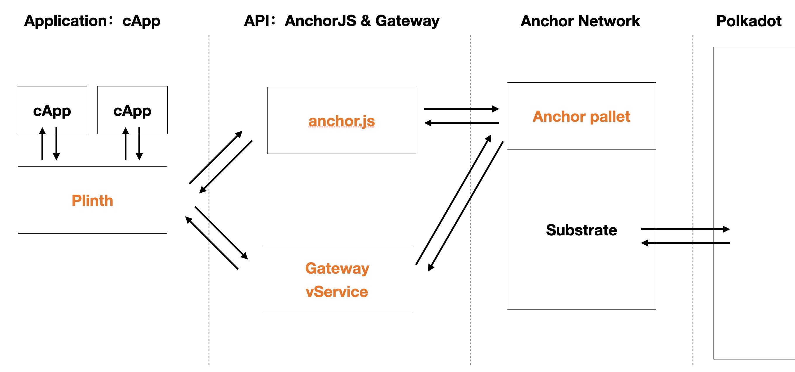

# EasyPolka

## Overview

- An easy way to develop blockchain , base on Polkadot/Substrate. Totally on chain application solution.

Structure of EasyPolka is here.

## Components

### Anchor Network

- Anchor Network is base on [Substrate](https://github.com/paritytech/substrate) with [Anchor Pallet](https://github.com/ff13dfly/Anchor), it will be a parachain of Polkadot Network.

### Easy Protocol

- Simple protocol to link Anchor and load `Chain Application ( cApp )`.

### Launcher

- The implement of `Easy Protocol`.

### Chain Application ( cApp )

## Resource

### Substrate Tools
