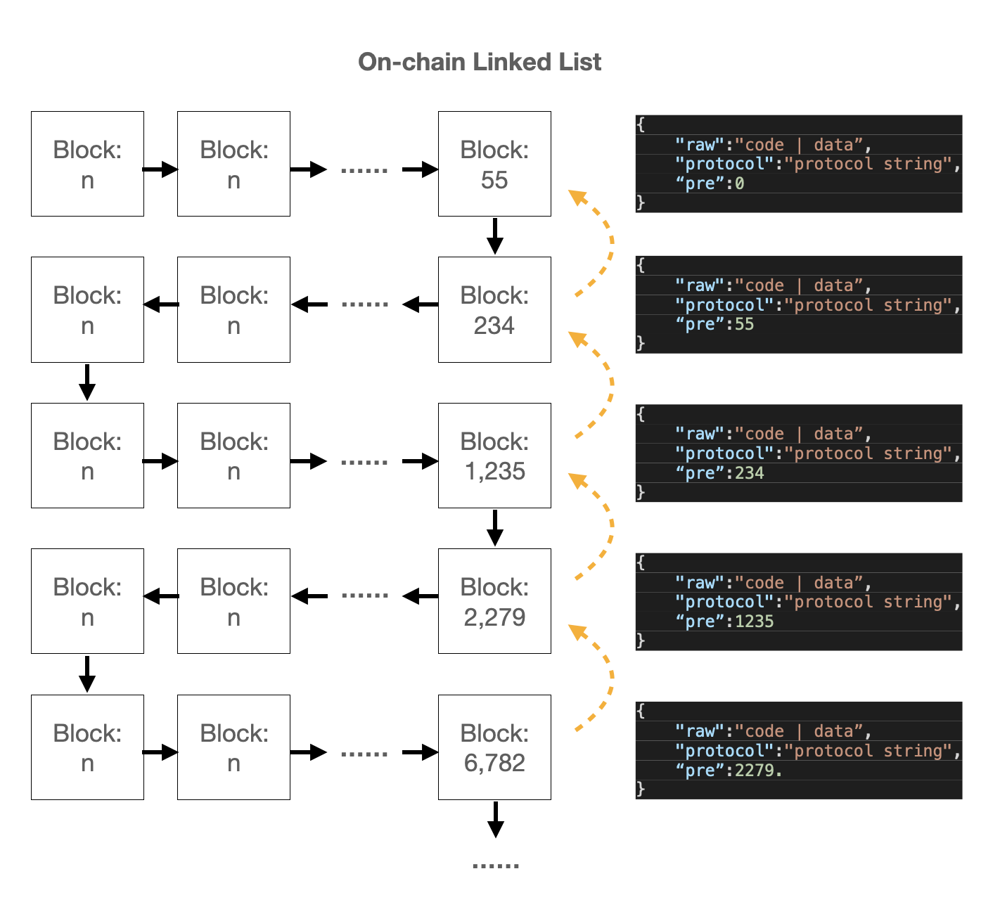

# Easy Protocol

## Overview

* `Easy Protocol` is teh recommend `cApp` ( Chain Application ) protocol. It is a JSON based protocol, now `version 1.0`.

* `Easy Protocol` solve the relationship between Anchors, by follow this protocol, one Anchor can call another anchor to get data or run `cApp`.

* Support language : Javascript.

## Relatioship Details

### Anchor Link

* Anchor Link is a text to locate the Anchor network data. It can be easy read and load `cApp` properly.

* Charactor `?` is reversed, the Anchor which including `?` is not supported by `Easy Protocol`.

### How To Launch

* The reversed keyword `type` is treated as the start of `Easy Protocol`, when the `protocol` data is a JSON string and the keyword is one of the JSON key. Then it is a `Easy Protocol` anchor.

* Anchor data will be checked as follow. 

    1. Check Anchor `protocol`, if it is `JSON` format and do have the keyword `type`.
    2. By `type`, Anchor will be treated as three types, `DATA`, `APP` and `LIB`.
    3. Public support functions. `hide`,`auth` and `salt`.
    4. `APP` support functions. `call` and `push`.

* Anchor link checking need to read Anchor network data.

### Reversed Keywords

* Depending on different type, the reversed keywords group as following table.

    | Type | All | Public | Extend |
    | ------ | ----------- |----------- |----------- |
    | App | type,fmt,ver| [hide],[auth],[salt] | [lib] |
    | Data | type,fmt|[hide],[auth],[salt]|[code],[call],[push],[args]|
    | Lib | type,fmt | [hide],[auth],[salt]| [code],[lib] |

## Types of Easy Protocol

### Data

* `type`
* `fmt`
* `hide`
* `auth`
* `salt`
* `call`
* `args`
* `code`
* `push`

### App

* `type`
* `fmt`
* `ver`
* `hide`
* `auth`
* `salt`
* `lib`

### Lib

* `type`
* `fmt`
* `hide`
* `auth`
* `salt`
* `lib`
* `code`

## Extend Functions

### Hide Target Anchor History

* If there is `hide` keyword in protocol, will check the target anchor `hide`.

* If theer is `salt` keyword in protocol, will check the target `md5( anchor + salt[1] )` to check hide block list.

* No special setting, will check the default hide anchor `md5(anchor)`.

#### Authrity of Anchor

* If there is `auth` keyword in protocol, will check the target anchor `auth`.

* If theer is `salt` keyword in protocol, will check the target `md5( anchor + salt[0] )` to check authority list.

* No special setting, will check the default authority anchor `md5(anchor)`.

#### Library Management

* Easy Protocol support full on-chain application.
