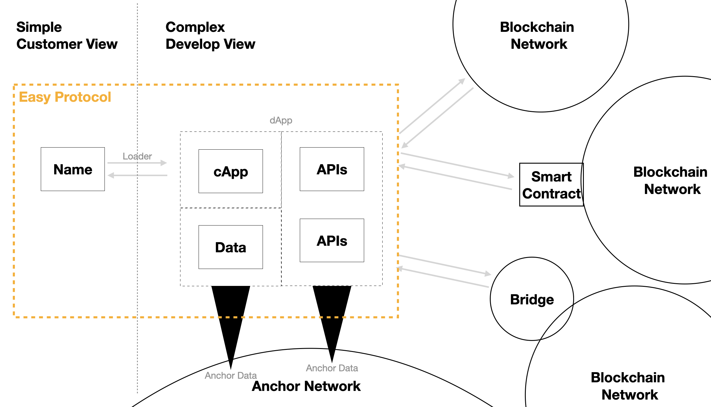
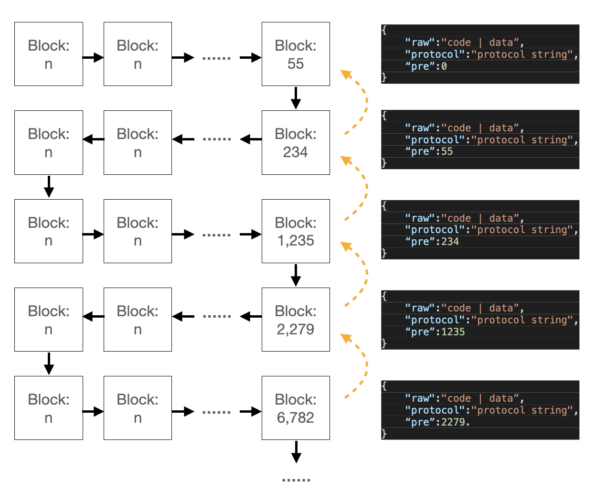

# Easy Protocol ( v1.0 )

- 参考HTTP协议：[https://www.w3.org/Protocols/HTTP/1.0/spec](https://www.w3.org/Protocols/HTTP/1.0/spec)

## 概述

- `Easy Protocol`是用来实现全链应用程序的协议，基于简单易读的JSON，现在的版本是`v1.0`。`Easy Protocol`着力解决链上数据的关系，建立一个可以自启动的区块链网络（Anchor Network），这样，就可以通过单一的去中心化的入口来访问Web3.0的世界。

    

- `Easy Protocol`的协议主体大小写不敏感，最大长度是256字节。`Easy Protocol`不对运行的代码进行限定。为方便描述，以下将采用Javascript和JSON的形式进行代码说明。

- `Easy Protocol`是如何实现可自启动的Web3.0的呢？是基于以下两个特性
    1. 数据全上链。当所有数据都在链上的时候，就可以实现链上启动Web3.0的功能，只需要一个加载器来引导到对应的入口程序。
    2. 链上数据可组织。对链上的资源进行简单和固定方式进行定位和访问，是组织大型程序的基础，同时，还要处理好资源之间的有效性、授权关系。

- 以下章节将介绍`Easy Protocol`的特性，简介如下：
    1.`词汇表`:涉及到的概念，协议中的定义及特性说明
    2.`数据结构`:协议主要构成部分，说明了协议的存储结构，数据关联的锚链接，以及链锚的授权关系和申明删除
    3.`关键字`:详解协议中各个关键字的定义及使用方法
    4.`错误处理`:协议中出现的各种错误的说明及状态码
    5.`启动器`:从链上实现程序启动的启动器

## 词汇表

1. Anchor，链锚，`Easy Protocol`协议使用的链上数据存储方式，既是高效的KV链上储存，也是可回溯的线上链表储存。
2. Anchor Linker，类似于URI的链上资源链接，可以直接标定链锚数据。
3. Declared Hidden，数据所有者通过显性的申明，隐藏指定的链上数据，是一种伪删除。
4. Authorty，链锚数据之间的相互信任关系，链锚数据和账户之间的信任关系
5. Loader，从链上启动程序的加载器，通过该加载器即可浏览整个链的内容，类似于计算机系统的BIOS。

## 数据结构

### 数据存储 （链锚）

- `Easy Protocol`的数据由4部分组成，`name`用来标识唯一性，`raw`是存储部分，`protocol`是数据的协议部分，`pre`用来建立链上数据的连接关系。可以表述成如下的数据关系：

    ```Javascript
        {
            "name":"UNIQUE_NAME",       //unique name, called `Anchor Name`
            "raw":"CUSTOMIZE_DATA",     //code or customized data
            "protocol":{                //Easy Protocol content
                ...
            }
            "pre":0,                    //block number of previouse anchor data
        }
    ```

    | Keywords | Type | Min | Max | Notes
    | ------ | ----------- |----------- |----------- | ----------- |
    | name | `string` | 0 | 40 | `?` reversed
    | raw | `vec<u8>` | 0 | 4MB| suggest |
    | protocol | `vec<u8>` | 0 | 256 | suggest |
    | pre | `u128` |0 | * | |

- 将Anchor写入到链上（例如 Anchor Network），就确定了其所有者，即对数据进行了保护。一来数据被写入链上，已经处于无法篡改的状态；二来数据的更新，也必须要所有者权限才能进行。链锚的数据通过`pre`进行关联，形成链上链表的数据结构，历史数据也可以方便的进行获取。

- `Easy Protocol`链上数据储存的状态如下图所示, 链上状态只需要记录最后一个区块数据"6782"即可。
    

### 锚链接（ Anchor Link ）

- 锚链接是类似于URI的链上数据定位方式，方便外部系统快速定位链上资源。其完整格式如下所示意。

    ```SHELL
        # Format of Anchor Link
        anchor://{name}[/][{block}][/][?][{key}={val}&{key}={val}][@][network]
    ```

     ```SHELL
        # "hello" sample
        anchor://hello
        anchor://hello/
        anchor://hello/1886
        anchor://hello/1886/
        anchor://hello/1886?tpl=dark&title=today
        anchor://hello/1886?tpl=dark&title=today@testnet
    ```

- `?`作为锚链接的参数分割符，对于用于`Easy Protocol`的链锚名称里不应该包含。

- 参数覆盖问题，anchor数据上可以设置参数，而外部也可以穿入参数，如果出现冲突，传入的参数优先。

### 授权

- 基于区块链的Web3.0世界是一个开发的世界，数据开放是其底层特征。`Easy Protocol`建立一种基于透明数据的授权关系，建立关于数据访问的权限关系。

- `Easy Protocol`的授权处理两种关系，一是数据和账户之间的，另一种是数据和数据之间的。

#### 账户授权

- 在链锚的协议部分，使用`auth`关键字，通过直接写入和链锚的方式，对账户进行授权，定义如下。

    ``` javascript
        {
            "ACCOUNT":"BLOCK_NUMBER",       //当BLOCK_NUMBER为0时，为无限时授权
        }
    ```

- 直接写入以最新的数据为准，链锚方式，接受全部的数据。按照最新写入的数据进行授权限制。

#### 链锚授权

- 在链锚的协议部分，使用`trust`关键字，通过直接写入和链锚的方式，对账户进行授权

    ``` javascript
        {
            "ANCHOR_NAME":"BLOCK_NUMBER",       //当BLOCK_NUMBER为0时，为无限时授权
        }
    ```

- 直接写入以最新的数据为准，链锚方式，接受全部的数据。按照最新写入的数据进行授权限制。

#### 授权时限及重复授权

- 采用授权到区块号的方式，0为无限时授权。注意，由于出块时间的不确定性，和现实世界的时间无法精确匹配。

- 重复授权是指，对于Anchor，如果未被授权，但是写入Anchor的address确是被授权的。采取账号授权优先的原则。换言之，账号授权的权限是大雨anchor授权的。

### 申明删除（ Declared Hidden ）

- 基于区块链的特性，链上的数据是无法删除的，`Easy Protocol`建立一种基于透明数据的申明删除方式，实现指定数据的隐藏。这让遵循`Easy Protocol`建立的应用程序，可以模拟删除操作，衔接现有的开发模式。

- `Easy Protocol`的申明删除，只能对自己实现，使用`hidden`关键字来实现。

- 直接申明删除，此方式下，仅使用最新的数据

    ```Javascript
        {
            "hidden":[ BLOCK_NUMBER , BLOCK_NUMBER , ... ]
            ...
        }
    ```

- 链锚申明删除，此方式下，仅使用最新的数据

    ```Javascript
        {
            "hidden": "ANCHOR_NAME"
            ...
        }

        //ANCHOR_NAME 数据样式
        [ BLOCK_NUMBER , BLOCK_NUMBER , ... ]
    ```

## 关键字

### 基本情况

- `Easy Protocol`使用`JSON`格式，基本样例如下：

    ```JSON
        {
            "type":"data",
            "fmt":"json",
            "call":"app_anchor",
            "hide":""
            ...
        }
    ```

- `Easy Protocol`数据字符串化后的最大长度为256字节，便于存储于链上，

### 关键字分类

- 根据type的不同，协议采用不同的关键字，v1版本目前支持3种type类型。
- 对于`Easy Protocol`不支持的关键字，将全部搜集到`un`关键字下。

#### 数据类型 ( data )

- `type`, must be `data`.
- `fmt`,数据格式，默认为`JSON`
- `hide`,直接的hide数据，或者指向到存储的anchor
- `auth`,直接的auth数据，或者指向到存储的anchor
- `trust`,直接的trust数据，或者指向到存储的anchor
- `call`,呼叫的cApp,会进行授权检测。当指定到限定的版本时，注意授权的问题 **bug，需要再考虑清楚**
- `args`,默认传给cApp的参数，用于默认配置。和外部参数冲突时，外部参数权限高
- `code`,数据编码方式，默认为utf-8

#### 程序类型 ( app )

- `type`, must be `app`.
- `fmt`,程序格式，默认为`js`.
- `ver`,程序版本，使用的格式为`ver.sub.step`方式，必须逐步升高
- `hide`,直接的hide数据，或者指向到存储的anchor
- `auth`,直接的auth数据，或者指向到存储的anchor
- `trust`,直接的trust数据，或者指向到存储的anchor
- `lib`,程序引用的链上资源库
- `ext`, 程序扩展引用的链上资源库

#### 资源类型 ( lib )

- `type`, must be `lib`.
- `fmt`,程序格式，默认为`js`.
- `hide`,直接的hide数据，或者指向到存储的anchor
- `auth`,直接的auth数据，或者指向到存储的anchor
- `trust`,直接的trust数据，或者指向到存储的anchor
- `lib`, 程序引用的链上资源库
- `ext`, 程序扩展引用的链上资源库

## 错误处理

- 错误类型，分为[system,anchor]级别

- 错误汇总表如下

    | code | level | message |
    | ------ | ----------- | ----------- |
    | 2001 | system | 无法连接到Anchor网络节点 ｜
    | 2002 | system | 连接到错误节点，不支持Anchor存取 ｜
    | 2101 | system | 无法读取Anchor数据 ｜
    | 2102 | system | 所有数据已经删除 ｜
    | 2103 | system | 无法读取授权数据 ｜
    | 2201 | anchor | 无法识别的协议 ｜
    | 2202 | anchor | 无效的数据类型 ｜
    | 2203 | anchor | 无效的申明隐藏数据 ｜
    | 2204 | anchor | 无效的授权数据 ｜
    | 2205 | anchor | 无效的信任数据 ｜
    | 2206 | anchor | 版本信息错乱 ｜

## 启动器

- 支持`Easy Protocol`的区块链网络上可以存储可运行的数据，但需要借助一个启动器来运行。启动器解析锚链接后，去获取指定的链上资源，来运行程序，实现启动。

- 启动器需要具备解析链锚的能力及读取链上数据的能力。启动器加载完链上程序后，即退出执行，不需要为后继程序提供任何访问支持。
