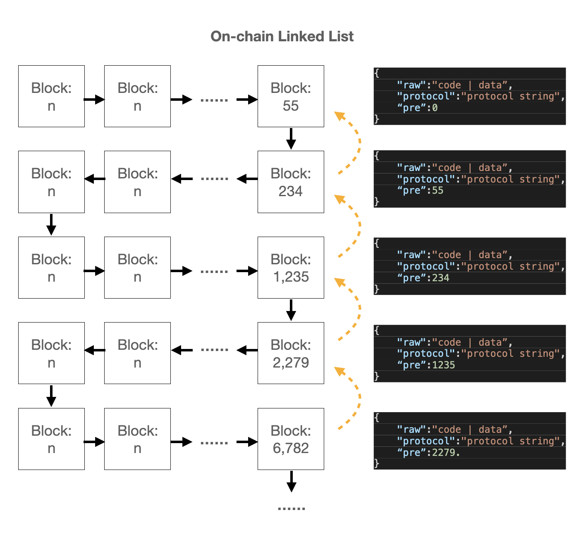

# Easy Protocol

## Overview

Recommand cApp protocol. It is a JSON based protocol, now `version 1.0`.

## Details

### Protocol Check

The reversed keyword `type` is treated as the start of `Easy Protocol`, when the `protocol` data is a JSON string and the keyword is one of the JSON key. Then it is a `Easy Protocol` anchor.



### Anchor link

### Reversed Keywords

### cApp Lancher

## Test

- TS file need to compile to JS file, then run via Node.js.

    ```SHELL
        # install TS support
        npm i -D typescript

        # compile ts file
        npx tsc ${sample}.ts

        # run the compiled file
        node ${sample}.js
    ```

### Anchor Link Decode

### Chain Application Launch

```javascript
    const cApp = new Function("agent", "con", "error", raw);
    cApp(RPC, "container", code.failed ? code.failed : null);
```

### Hide Target Anchor History

- If there is `hide` keyword in protocol, will check the target anchor `hide`.
- If theer is `salt` keyword in protocol, will check the target `md5( anchor + salt[1] )` to check hide block list.
- No special setting, will check the default hide anchor `md5(anchor)`.

### Authrity of Anchor

- If there is `auth` keyword in protocol, will check the target anchor `auth`.
- If theer is `salt` keyword in protocol, will check the target `md5( anchor + salt[0] )` to check authority list.
- No special setting, will check the default authority anchor `md5(anchor)`.
